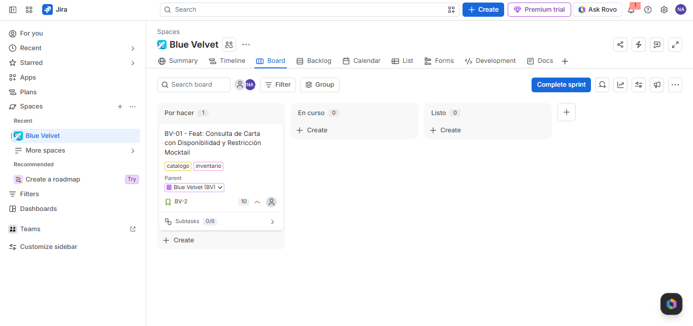

## Sprint Backlog - Sprint 1

### Evidencia de Planeación

### Justificación de la Planeación del Sprint 1
Para este primer iterativo (Sprint 1), el equipo decidió priorizar el **Feature BV-01 (Consulta de Carta con Disponibilidad y Restricción Mocktail)**, el cual concentra las dos primeras historias de usuario con un peso total de 10 puntos.

**Criterios de selección:**
1. **Valor de negocio inicial:** Es el punto de partida obligatorio para la operación de Blue Velvet; sin la carta digital interactiva y la sincronización del inventario de insumos en tiempo real, ningún cliente puede explorar el catálogo ni realizar pedidos.
2. **Mitigación de riesgos operativos:** Incluye la lógica de exclusión de alcohol para Mocktails (Regla de Negocio 2), garantizando la seguridad de los clientes abstemios desde la primera versión funcional.
3. **Capacidad del equipo:** Las subtareas técnicas fueron distribuidas equitativamente para asegurar su desarrollo completo dentro del periodo establecido sin sobrepasar la velocidad estimada del equipo.
# Evidencias parte 6 - Jira

**Contexto**  
Como en nuestra versión de Jira no hay explicitamente "Features" entonces se adaptaron los siguientes niveles:

> 1. **Nivel 1 (Épica):** Se mantiene la Épica central del proyecto (`Blue Velvet (BV)`), agrupando el ciclo de vida del restaurante.
> 2. **Nivel 2 (Features como Historias):** Las dos capacidades principales del sistema se crearon como issues de tipo **Story**, utilizando el prefijo y nomenclatura `Feat: [Nombre del Feature]` (`BV-01` y `BV-02`). La descripción de cada una documenta formalmente las **dos Historias de Usuario (HUs)** asociadas (completando las 4 HUs requeridas), sus justificaciones de prioridad, valor de negocio y criterios de aceptación.
> 3. **Nivel 3 (Subtareas ):** Las 12 unidades de trabajo técnico se modelaron como **Subtasks** directamente anidadas como hijas (*Child Issues*) de sus respectivos Features (6 subtareas por cada Feature/Story), indicando en el título la HU específica a la que dan soporte operativo.

1. Captura de la épica

2. Creación de los 2 features

3. Visualización 4 Historias de usuario

4. Creación 12 subtareas

5. Visualización prioridades

6. Cronograma completo

