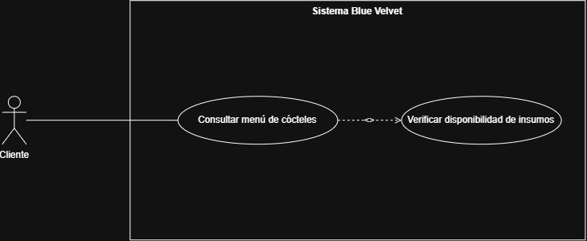
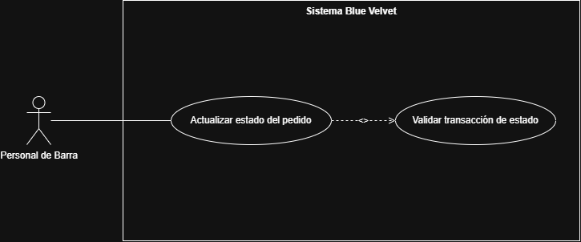
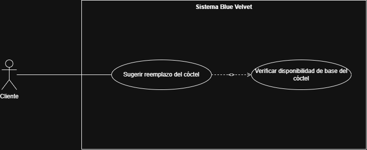

## Requerimientos

### RF01 — Consultar menú de cócteles con disponibilidad

**Descripción:**  El cliente puede consultar el menú de cócteles de la coctelería, visualizando para cada uno su disponibilidad actual en
función de los insumos existentes en barra. Un cóctel se marca automáticamente como no disponible si alguno de sus insumos base está
agotado.

**Actores:** Cliente

**Precondiciones:** El cliente tiene acceso al sistema (mesa asignada o sesión iniciada). El menú ha sido previamente configurado por el
administrador.

**Flujo principal:** 
1. El cliente accede al menú digital.
2. El sistema consulta el inventario de insumos en tiempo real.
3. El sistema muestra cada cóctel junto con su estado de disponibilidad.

### Mockups

Para garantizar la cobertura visual y funcional de este requerimiento, se diseñó el flujo de pantallas y la guía de accesibilidad bajo el concepto **Blue Velvet**:

* **Pantallas Detalladas del Requerimiento:**
  1. **Bienvenida e Identificación de Mesa:** [Paso1.png](../images/Paso1.png)
  2. **Catálogo de Cócteles con Disponibilidad:** [Paso2.png](../images/Paso2.png.png)
  3. **Detalle de Cóctel y Selección de Licor Base:** [Paso3.png](../images/Paso3.png)
  4. **Modo Mocktail 0.0% con Bloqueo de Licores:** [Paso4.png](../images/Paso4.png)
  5. **Detección Visual de Insumo Agotado en Barra:** [Paso5.png](../images/Paso5.png)
  6. **Reemplazo Inteligente de Cóctel:** [Paso6.png](../images/Paso6.png)
LINK MOCKUP FIGMA: https://www.figma.com/make/Vcgs1wQfyADXk2LKRqlgXK/Blue-Velvet-cocktail-bar-app?fullscreen=1&t=bfSx15gNiiOVeyb5-1&code-node-id=0-6

###  RF04 — Actualizar estado del pedido (barra)

**Descripción:** El personal de barra puede cambiar el estado de un pedido a medida que avanza en su preparación, siguiendo una secuencia
fija de estados: RECIBIDO → EN PREPARACIÓN → LISTO → ENTREGADO.

**Actores:** Personal de barra

**Precondiciones:** El pedido existe y fue previamente confirmado y enviado al tablero de barra (RF03). El pedido está en un estado que
permite avanzar al siguiente.

**Datos de entrada:** ID del pedido, nuevo estado seleccionado.

**Datos de salida:** Confirmación del cambio de estado, actualización visible en el tablero de barra y para el mesero/cliente.

**Flujo principal:**
1. El personal de barra visualiza el pedido en el tablero.
2. Selecciona el pedido y elige el siguiente estado en la secuencia.
3. El sistema valída que la transición sea válida.
4. El sistema actualiza el estado y registra el cambio con usuario y hora (auditabilidad).

###  RF06 — Reemplazo de cóctel por insumo agotado

**Descripción:** Cuando la base principal de un cóctel deja de estar disponible en inventario, el sistema ofrece automáticamente al cliente
una sugerencia de reemplazo con un cóctel similar cuya base sí esté disponible.

**Actores:** Cliente (sistema actúa de forma automática, sin actor de barra involucrado directamente)

**Precondiciones:** El cliente ha seleccionado o intenta seleccionar un cóctel cuya base se agotó después de que el menú fue cargado, o en
el momento de agregarlo al pedido.

**Datos de entrada:** Selección del cóctel original por parte del cliente.

**Datos de salida:** Sugerencia de cóctel alternativo (nombre, descripción, diferencia de precio si aplica).

**Flujo principal:**
1. El cliente intenta agregar un cóctel al pedido.
2. El sistema verifica la disponibilidad de la base del cóctel.
3. Si la base no está disponible, el sistema busca un cóctel alternativo con base disponible y lo sugiere al cliente.
4. El cliente acepta o rechaza el reemplazo.

### Funcionales
* RF01: El cliente puede consultar el menú de cócteles junto con la disponibilidad de cada uno según los insumos existentes en barra.
* RF02: El cliente o el mesero puede agregar, modificar o eliminar ítems de un pedido mientras la cuenta de la mesa/barra siga abierta.
* RF03: Al confirmar el pedido, este se envía automáticamente al tablero de la barra para su preparación.
* RF04: El personal de barra puede actualizar el estado de cada pedido a través de los estados RECIBIDO -> EN PREPARACIÓN -> LISTO -> ENTREGADO.
* RF05: El administrador o mesero puede cerrar la cuenta de una mesa/barra, registrar el pago asociado y generar la factura correspondiente. 
* RF06: El sistema ofrece un reemplazo de un cóctel del cliente cuando alguna base de la bebida haya cesado de encontrarse en el inventario.

### No Funcionales
* RNF01: El acceso a cada módulo del sistema está registrado según el rol del usuario (cliente, mesero, barra, administrador)
* RNF02: El tablero de barra debe mostrar un nuevo pedido en un tiempo no mayor a 2 segundos desde su confirmación.
* RNF03: El sistema debe permanecer operativo durante todo un turno de atención (un mínimo de 12 horas continuas) sin necesidad de reiniciarlo.
* RNF04: Un cliente nuevo debe poder completar su pedido de forma fácil y navegando por un máximo de 4 pantallas.
* RNF05: Cada cambio de estado de un pedido debe quedar registrado con el usuario responsable y la marca de tiempo en que ocurrió.

### Preguntas de análisis crítico:

a) ¿Identifica algún requerimiento que deba detallarse más? ¿Cuál(es)? ¿Por qué?

* RF06 podría detallarse más: falta definir qué criterio usa el sistema para elegir el cóctel de reemplazo (¿mismo tipo de licor?, ¿precio similar?, ¿categoría?). Sin ese criterio explícito, no es del todo verificable ni implementable de forma consistente.

b) ¿Existen requerimientos que se contradigan entre sí? ¿Cuál(es)?

* RF02 permite modificar o eliminar ítems del pedido mientras la cuenta esté abierta, pero RF04 establece que un pedido deja de ser modificable una vez pasa a EN PREPARACIÓN. Ambos no se contradicen del todo, pero conviene aclarar en RF02 que esa modificación solo aplica mientras el pedido siga en estado RECIBIDO, para que sea coherente con la regla de negocio de RF04.

c) Si tuviera que dar prioridad, ¿cuáles serían los 2 más importantes para una primera iteración? Justifique.

* RF01 (consultar menú con disponibilidad) y RF03 (confirmar pedido y enviarlo a barra), porque sin esos dos no existe el ciclo mínimo de operación: el cliente no puede saber qué ordenar, ni la barra recibir el pedido. Son la base sobre la que dependen el resto de RF (agregar ítems, cambiar estados, cobrar).

d) ¿Existe algún requerimiento que NO debería realizarse en el MVP? ¿Por qué?

* RF06 (reemplazo automático de cóctel) podría dejarse fuera del MVP: no es crítico para validar el ciclo completo de una orden (carta → pedido → barra → pago), y puede resolverse manualmente por el mesero mientras se valida el resto del sistema. Es una mejora de experiencia, no un bloqueador funcional.